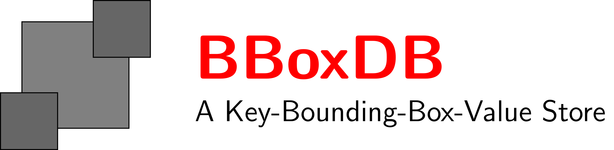

  

  		

			

				
			

		

		

			<h1>BBoxDB</h1>
			
A Key-Bounding-Box-Value Store for multi-dimensional big data.

			

				<a target="_blank" class="btn btn-lg btn-default"
					href="https://github.com/jnidzwetzki/bboxdb">  View on GitHub
				</a> &nbsp; &nbsp; &nbsp; <a target="_blank"
					class="btn btn-lg btn-success"
					href="http://jnidzwetzki.github.io/bboxdb/doc/installation.html">  Installation
				</a>
			

		

		

			

				<h3>
					 Innovative
				</h3>
				
This project enhances the concept of traditional key-value stores by a
					bounding box. This makes it possible to store data in a more
					efficient way.

			

			

				<h3>
					 Distributed
				</h3>
				
Data is stored distributed, and highly available. No single point
					of failure does exist.
				

			

			
			

				<h3>
					 Scalable
				</h3>
				
BBoxDB can be scaled up to handle big data by adding additional nodes.
				

			

		

		

			

				<h3>
					
					Multidimensional
				</h3>
				
BBoxDB supports multidimensional data (point and non-point) with any dimension.

			

			

				<h3>
					 Open-Source
				</h3>
				
The software is developed as an open-source project at GitHub. The
					code is licensed under the Apache 2.0 license.

			

			
			

				<h3>
					 Co-Location
				</h3>
				
Data can be stored co-partitioned, which enables efficient query processing.

			

		

		

			

				<h3>
					 Operations
				</h3>
				
Operations such as spatial joins or range queries are supported.

			

			

				<h3>
					
					User-Defined Filter
				</h3>
				
Custom data formats can be decoded by adding user-defined filter. In addition, additional operations can be added to the query processor.

			

			

				<h3>
					 Data Streams
				</h3>
				
BBoxDB Streams is an extension for the distributed handling of data streams. The extension supports continuous range queries and continuous spatial joins.

			

			

		

    
